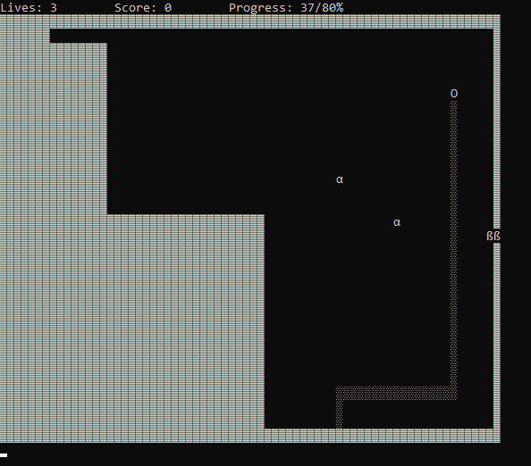

:warning: Not maintained; but, feel free to fork it. :warning:

# PacXon

A partial PacXon game clone in C, on CLI (you can play the original version [here](https://www.pacxon.net/)).

This game was my final project for the **computer fundamentals and programming** university course, made in **early 2019**.

## Simple build & run

> Pro-tip: use an **IDE** to build and run the project.

### Ubuntu

> Tested on Ubuntu 22.04 LTS.

- `sudo apt install cmake gcc make libncurses-dev`.
- `cmake . && make && ./PacXon`

Or

- `sudo apt install gcc libncurses-dev`
- `gcc main.c -lncurses && ./a.out`

### Other Operating Systems, including Windows

Figure it out :slightly_smiling_face:.

> For Windows, you can check out earlier commit [765f67781980fb90d9b2bdfef960878687298926](https://github.com/agcom/pacxon/tree/765f67781980fb90d9b2bdfef960878687298926) and follow the instructions said there.
